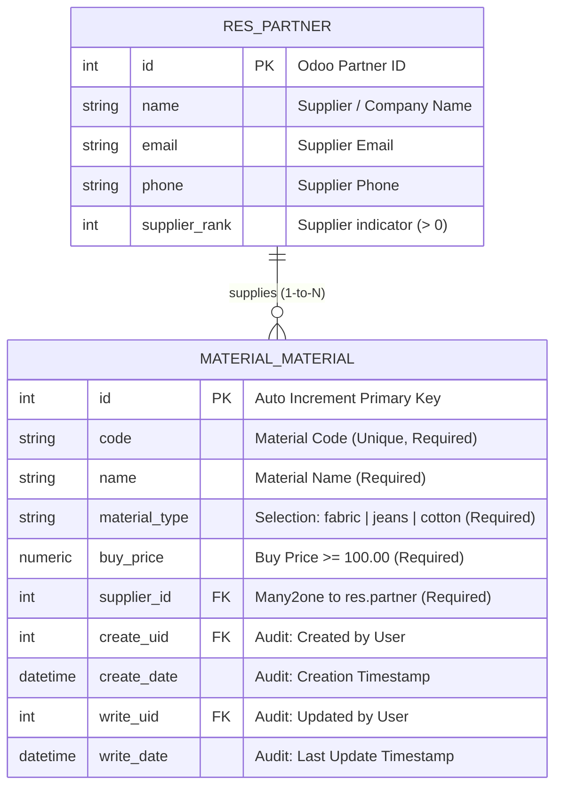

# Material Management Module - Odoo 14

[](https://www.odoo.com)
[](https://www.python.org/)
[](https://www.postgresql.org/)
[](https://www.docker.com/)
[]()

Repositori ini berisi implementasi modul custom **Material Management** (`material_management`) untuk platform **Odoo 14 Community / Enterprise**, yang dibangun untuk memenuhi seluruh persyaratan teknis **Backend Odoo Test** dari **KeDA Tech**.

Modul ini menyediakan sistem pencatatan master data material siap jual dengan validasi integritas data berlapis (Python & SQL constraints), relasi supplier resmi (`res.partner`), antarmuka Web Odoo (Tree, Form, Search dengan custom filter), REST API berbasis JSON Controller (CRUD & filter by type), serta Automated Unit Testing suite.

---

## Daftar Isi
1. [Ringkasan Pemenuhan Kewajiban Test](#1-ringkasan-pemenuhan-kewajiban-test)
2. [Tugas 1: Entity Relationship Diagram (ERD)](#2-tugas-1-entity-relationship-diagram-erd)
3. [Tugas 2: Implementasi Model & Validasi Bisnis](#3-tugas-2-implementasi-model--validasi-bisnis)
4. [Tugas 3: Implementasi Controller (REST API JSON)](#4-tugas-3-implementasi-controller-rest-api-json)
5. [Tugas 4: Automated Unit Testing](#5-tugas-4-automated-unit-testing)
6. [Struktur Direktori Proyek](#6-struktur-direktori-proyek)
7. [Panduan Menjalankan Proyek (Quick Start)](#7-panduan-menjalankan-proyek-quick-start)
8. [Pengujian API via Postman & cURL](#8-pengujian-api-via-postman--curl)

---

## 1. Ringkasan Pemenuhan Kewajiban Test

Berikut adalah matriks kesesuaian antara instruksi pada dokumen soal *Backend Odoo Test* dengan implementasi yang disediakan:

| No | Kewajiban Soal (KeDA Tech) | Status | Implementasi Teknis & Lokasi File |
| :---: | :--- | :---: | :--- |
| **1** | **Membuat ERD dari kebutuhan Client** | **SELESAI** | Diagram ERD Mermaid & Kamus Data relasional antara `MATERIAL_MATERIAL` dan `RES_PARTNER`. |
| **2** | **Membuat Models** | **SELESAI** | Model `material.material` di [`addons/material_management/models/material.py`](addons/material_management/models/material.py) mencakup 5 field wajib, dropdown 3 tipe, validasi harga beli `>= 100`, dan kode unik. |
| **3** | **Membuat Controllers (REST API)** | **SELESAI** | Controller di [`addons/material_management/controllers/main.py`](addons/material_management/controllers/main.py) menyediakan 5 endpoint JSON untuk Create, List & Filter by Type, Read Detail, Update, dan Delete. |
| **4** | **Membuat Unit Testing** | **SELESAI** | Suite pengujian otomatis di folder [`addons/material_management/tests/`](addons/material_management/tests/) menguji model constraints dan HTTP controller API (16 tests lulus, 0 errors, 0 failures). |

---

## 2. Tugas 1: Entity Relationship Diagram (ERD)

### 2.1 Diagram ERD

Relasi antara model **Material** (`material.material`) dan model partner/supplier bawaan Odoo (**Supplier** / `res.partner`):



### 2.2 Kamus Data (`material_material`)

| Nama Field (Python) | Kolom Database (PostgreSQL) | Tipe Data | Keterangan & Batasan Integritas |
| :--- | :--- | :--- | :--- |
| `id` | `id` | `INTEGER` | Primary Key, Auto Increment sequence. |
| `code` | `code` | `VARCHAR` | **Wajib diisi (`required=True`)**, unik via SQL Constraint. |
| `name` | `name` | `VARCHAR` | **Wajib diisi (`required=True`)**, nama material yang dijual. |
| `material_type` | `material_type` | `VARCHAR` | **Wajib diisi (`required=True`)**, pilihan: `'fabric'`, `'jeans'`, `'cotton'`. |
| `buy_price` | `buy_price` | `NUMERIC(16,2)` | **Wajib diisi (`required=True`)**, validasi **tidak boleh < 100**. |
| `supplier_id` | `supplier_id` | `INTEGER` | **Wajib diisi (`required=True`)**, Foreign Key ke `res_partner.id` (`ondelete='restrict'`). |

---

## 3. Tugas 2: Implementasi Model & Validasi Bisnis

Model didefinisikan pada file [`addons/material_management/models/material.py`](addons/material_management/models/material.py).

### Fitur Kunci Model:
1. **Dropdown Material Type**:
   Menggunakan Odoo `fields.Selection` dengan 3 opsi:
   - `fabric`: Fabric
   - `jeans`: Jeans
   - `cotton`: Cotton
2. **Validasi Harga Beli (`buy_price >= 100`) Berlapis**:
   - **Level Python (`@api.constrains('buy_price')`)**: Menampilkan pesan error ramah pengguna di Web UI (`ValidationError`) jika nilai < 100.
   - **Level Database (`_sql_constraints`)**: Mencegah nilai tidak valid lolos ke PostgreSQL melalui `CHECK(buy_price >= 100)`.
3. **Integritas Kode Unik (`code`)**:
   - Dicegah duplikasi melalui constraint unik SQL: `UNIQUE(code)`.
4. **Relasi Supplier (`supplier_id`)**:
   - Terhubung ke model bawaan Odoo `res.partner` dengan domain `[('supplier_rank', '>', 0)]` agar dropdown hanya menampilkan supplier.

---

## 4. Tugas 3: Implementasi Controller (REST API JSON)

Controller REST API diimplementasikan pada file [`addons/material_management/controllers/main.py`](addons/material_management/controllers/main.py) dengan base route `/api/v1/materials`.

### Daftar Endpoint

| Method | Endpoint | Fungsi | Status Code Sukses |
| :--- | :--- | :--- | :---: |
| **POST** | `/api/v1/materials` | Mendaftarkan material baru (validasi harga & kelengkapan) | `201 Created` |
| **GET** | `/api/v1/materials` | Menampilkan seluruh material atau filter tipe `?material_type=...` | `200 OK` |
| **GET** | `/api/v1/materials/<id>` | Mengambil detail informasi 1 material | `200 OK` |
| **PUT** | `/api/v1/materials/<id>` | Memperbarui informasi material | `200 OK` |
| **DELETE** | `/api/v1/materials/<id>` | Menghapus 1 material | `200 OK` |

---

### Contoh Request & Response REST API

#### 1. Registrasi Material Baru (`POST /api/v1/materials`)
- **Headers**: `Content-Type: application/json`
- **Request Body**:
  ```json
  {
    "code": "MAT-001",
    "name": "Kain Katun Rayon",
    "material_type": "cotton",
    "buy_price": 150000.0,
    "supplier_id": 1
  }
  ```
- **Response Success (`201 Created`)**:
  ```json
  {
    "status": "success",
    "message": "Material berhasil didaftarkan.",
    "data": {
      "id": 1,
      "code": "MAT-001",
      "name": "Kain Katun Rayon",
      "material_type": "cotton",
      "buy_price": 150000.0,
      "supplier": {
        "id": 1,
        "name": "PT Mitra Supplier"
      }
    }
  }
  ```
- **Response Error Validasi Harga < 100 (`400 Bad Request`)**:
  ```json
  {
    "status": "error",
    "message": "Material Buy Price tidak boleh nilainya < 100.",
    "errors": {
      "buy_price": "Nilai minimal adalah 100"
    }
  }
  ```

#### 2. Menampilkan Seluruh Material & Filter Tipe (`GET /api/v1/materials`)
- **Query Parameter (Opsional)**: `material_type` (`fabric`, `jeans`, atau `cotton`).
- **Contoh Request Filter**: `GET /api/v1/materials?material_type=jeans`
- **Response Success (`200 OK`)**:
  ```json
  {
    "status": "success",
    "count": 1,
    "filter": {
      "material_type": "jeans"
    },
    "data": [
      {
        "id": 2,
        "code": "JEAN-561",
        "name": "Jean Bro Anak",
        "material_type": "jeans",
        "buy_price": 154.0,
        "supplier": {
          "id": 14,
          "name": "Azure Interior"
        }
      }
    ]
  }
  ```

#### 3. Update Material (`PUT /api/v1/materials/<id>`)
- **Request Body**:
  ```json
  {
    "name": "Kain Katun Rayon Premium",
    "buy_price": 175000.0
  }
  ```
- **Response Success (`200 OK`)**:
  ```json
  {
    "status": "success",
    "message": "Material ID 1 berhasil diperbarui.",
    "data": {
      "id": 1,
      "code": "MAT-001",
      "name": "Kain Katun Rayon Premium",
      "material_type": "cotton",
      "buy_price": 175000.0,
      "supplier": {
        "id": 1,
        "name": "PT Mitra Supplier"
      }
    }
  }
  ```

#### 4. Hapus Material (`DELETE /api/v1/materials/<id>`)
- **Response Success (`200 OK`)**:
  ```json
  {
    "status": "success",
    "message": "Material 'Kain Katun Rayon Premium' (MAT-001) dengan ID 1 berhasil dihapus."
  }
  ```

---

## 5. Tugas 4: Automated Unit Testing

Suite pengujian otomatis disiapkan di folder [`addons/material_management/tests/`](addons/material_management/tests/):

1. **Model Tests (`test_material_model.py`)**:
   - `test_01_create_valid_material`: Memastikan material valid berhasil dibuat.
   - `test_02_buy_price_below_100_raises_validation_error`: Memastikan validasi menolak harga beli < 100 saat pembuatan.
   - `test_03_buy_price_update_below_100_raises_validation_error`: Memastikan update harga menjadi < 100 memicu `ValidationError`.
   - `test_04_duplicate_code_fails`: Memastikan pencegahan duplikasi kode material unik.
   - `test_05_to_dict_method`: Memastikan serialisasi kamus data material akurat.
2. **Controller Tests (`test_material_controller.py`)**:
   - `test_01_api_create_material_success`: Pengujian HTTP POST registrasi material sukses (201).
   - `test_02_api_create_material_price_below_100_rejected`: Pengujian HTTP POST harga < 100 ditolak (400).
   - `test_03_api_create_material_missing_fields_rejected`: Pengujian penolakan field wajib kosong (400).
   - `test_04_api_list_and_filter_materials`: Pengujian HTTP GET list dan filtering berdasarkan `material_type`.
   - `test_05_api_update_material`: Pengujian HTTP PUT update material (200).
   - `test_06_api_delete_material`: Pengujian HTTP DELETE penghapusan material (200).

### Perintah Menjalankan Unit Test

Jalankan perintah berikut di terminal:

```bash
docker-compose run --rm web odoo -d odoo_test -i material_management --test-enable --stop-after-init
```

### Hasil Eksekusi Unit Test:
```text
INFO odoo_test odoo.addons.material_management.tests.test_material_controller: Starting TestMaterialController.test_01_api_create_material_success ... 
INFO odoo_test werkzeug: 127.0.0.1 - - "POST /api/v1/materials HTTP/1.1" 201
INFO odoo_test odoo.addons.material_management.tests.test_material_controller: Starting TestMaterialController.test_02_api_create_material_price_below_100_rejected ... 
INFO odoo_test werkzeug: 127.0.0.1 - - "POST /api/v1/materials HTTP/1.1" 400
INFO odoo_test odoo.addons.material_management.tests.test_material_controller: Starting TestMaterialController.test_03_api_create_material_missing_fields_rejected ... 
INFO odoo_test werkzeug: 127.0.0.1 - - "POST /api/v1/materials HTTP/1.1" 400
INFO odoo_test odoo.addons.material_management.tests.test_material_controller: Starting TestMaterialController.test_04_api_list_and_filter_materials ... 
INFO odoo_test werkzeug: 127.0.0.1 - - "GET /api/v1/materials HTTP/1.1" 200
INFO odoo_test werkzeug: 127.0.0.1 - - "GET /api/v1/materials?material_type=jeans HTTP/1.1" 200
INFO odoo_test odoo.addons.material_management.tests.test_material_controller: Starting TestMaterialController.test_05_api_update_material ... 
INFO odoo_test werkzeug: 127.0.0.1 - - "PUT /api/v1/materials/91 HTTP/1.1" 200
INFO odoo_test odoo.addons.material_management.tests.test_material_controller: Starting TestMaterialController.test_06_api_delete_material ... 
INFO odoo_test werkzeug: 127.0.0.1 - - "DELETE /api/v1/materials/92 HTTP/1.1" 200
INFO odoo_test odoo.service.server: 11 post-tests in 0.96s, 177 queries 
INFO odoo_test odoo.tests.runner: 0 failed, 0 error(s) of 16 tests when loading database 'odoo_test'
```

---

## 6. Struktur Direktori Proyek

```text
.
├── .gitignore                                      # Konfigurasi ignore file lokal/OS/cache
├── docker-compose.yml                              # Konfigurasi Docker Odoo 14 & PostgreSQL 13
├── README.md                                       # Dokumentasi utama proyek & spesifikasi API
├── doc/
│   ├── Backend Odoo Test.pdf                       # Dokumen soal tes resmi KeDA Tech
│   ├── PRD.md                                      # Product Requirement Document & Desain Teknis
│   └── sintax.md                                   # Referensi sintaks perintah CLI
├── postman/
│   └── Material_Management_API.postman_collection.json # File koleksi Postman API CRUD
└── addons/
    └── material_management/                        # Modul Odoo 14 Material Management
        ├── __init__.py
        ├── __manifest__.py                         # Metadata & dependensi modul
        ├── models/
        │   ├── __init__.py
        │   └── material.py                         # Model material.material & validasi harga
        ├── controllers/
        │   ├── __init__.py
        │   └── main.py                             # REST API Controller (JSON)
        ├── views/
        │   ├── material_views.xml                  # Tree, Form, & Search views (filter type)
        │   └── menu_views.xml                      # Action & Menu Navigasi Odoo
        ├── security/
        │   └── ir.model.access.csv                 # Hak akses (Access Rights / ACL)
        └── tests/
            ├── __init__.py
            ├── test_material_model.py              # Unit test Model & constraints
            └── test_material_controller.py         # Unit test HTTP REST API Controller
```

---

## 7. Panduan Menjalankan Proyek (Quick Start)

### 7.1 Menyalakan Kontainer Docker
Pastikan Docker Engine atau Docker Desktop sudah aktif, lalu jalankan:

```bash
docker-compose up -d
```

### 7.2 Mengakses Web UI Odoo
1. Buka browser dan arahkan ke: `http://localhost:8069`.
2. Jika database belum dibuat, buat database baru (contoh nama: `odoo_test`).
3. Masuk ke menu **Apps** > klik **Update Apps List**.
4. Cari modul **Material Management**, lalu klik tombol **Install**.
5. Setelah instalasi selesai, menu utama **Material Management** akan muncul di bar navigasi atas.

---

## 8. Pengujian API via Postman & cURL

### 8.1 Import Koleksi Postman
File koleksi Postman siap pakai berada di:
[`postman/Material_Management_API.postman_collection.json`](postman/Material_Management_API.postman_collection.json)

**Langkah Import:**
1. Buka Postman.
2. Klik tombol **Import** (kiri atas).
3. Pilih file `postman/Material_Management_API.postman_collection.json`.
4. Seluruh request (Create, Filter, Detail, Update, Delete) sudah terkonfigurasi dengan URL variabel `{{base_url}}` (`http://localhost:8069`).

### 8.2 Contoh Pengujian via cURL

```bash
# 1. Registrasi material
curl -X POST http://localhost:8069/api/v1/materials \
  -H "Content-Type: application/json" \
  -d '{
    "code": "MAT-CURL-001",
    "name": "Kain Oxford Biru",
    "material_type": "cotton",
    "buy_price": 125000.0,
    "supplier_id": 1
  }'

# 2. Ambil list material terfilter tipe jeans
curl -X GET "http://localhost:8069/api/v1/materials?material_type=jeans"

# 3. Hapus material dengan ID 1
curl -X DELETE http://localhost:8069/api/v1/materials/1
```

---

## Lisensi & Kontributor
Dikembangkan oleh **Backend Engineer Candidate - Rafiyandi** untuk **KeDA Tech Backend Odoo Recruitment Test**.
