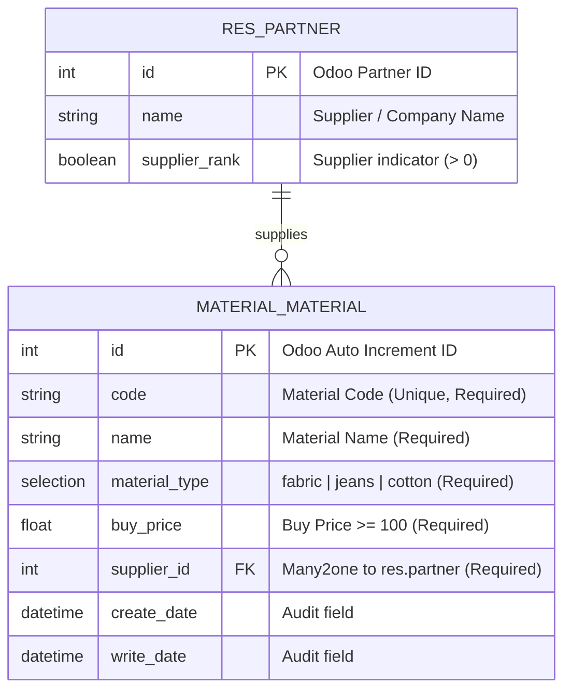

# Material Management Module - Odoo 14 (Backend Test)

Modul kustom Odoo 14 untuk mengelola registrasi master data material yang akan dijual, dilengkapi dengan validasi data bisnis, antarmuka Web Odoo, REST API Controller berbasis JSON, serta automated unit testing.

Dibuat untuk memenuhi persyaratan **Backend Odoo Test** dari **KeDA Tech**.

---

## 1. Entity Relationship Diagram (ERD)



---

## 2. Fitur & Validasi Bisnis

1. **Informasi Material**:
   - `Material Code`: Kode unik identifikasi material (*required, unique*).
   - `Material Name`: Nama material (*required*).
   - `Material Type`: Dropdown 3 pilihan: **Fabric**, **Jeans**, **Cotton** (*required*).
   - `Material Buy Price`: Harga beli material (*required, validation: tidak boleh < 100*).
   - `Related Supplier`: Dropdown rekanan vendor/supplier (*required, Many2one ke `res.partner`*).
2. **Validasi Harga Beli**:
   - Python Constraint (`@api.constrains('buy_price')`): Memunculkan pesan peringatan jika harga diisi di bawah 100.
   - Database Constraint (`CHECK(buy_price >= 100)`): Memastikan integritas data di level PostgreSQL.
3. **Penyaringan Data (Filter)**:
   - Pengguna dapat melihat seluruh material dan memfilter berdasarkan `Material Type` melalui Web UI maupun REST API.
4. **Operasi CRUD**:
   - Create, Read, Update, dan Delete material tersedia melalui antarmuka Web Odoo dan REST API.

---

## 3. Struktur Direktori

```text
odoo/
├── docker-compose.yml          # Konfigurasi Docker Odoo 14 & PostgreSQL 12
├── README.md                   # Dokumentasi panduan penggunaan & API
├── doc/
│   ├── Backend Odoo Test.pdf   # Dokumen soal tes
│   └── .ai/
│       └── PRD.md              # Product Requirement Document & Plan
├── postman/
│   └── Material_Management_API.postman_collection.json # File import Postman
└── addons/
    └── material_management/    # Modul Odoo 14
        ├── __init__.py
        ├── __manifest__.py
        ├── models/
        │   ├── __init__.py
        │   └── material.py     # Model material.material & validasi harga
        ├── controllers/
        │   ├── __init__.py
        │   └── main.py         # REST API Controller (CRUD & filter)
        ├── views/
        │   ├── material_views.xml # Tree, Form, Search (filter by type)
        │   └── menu_views.xml     # Menu navigasi Odoo
        ├── security/
        │   └── ir.model.access.csv # Access rights (ACL)
        └── tests/
            ├── __init__.py
            ├── test_material_model.py      # Unit test Model & constraints
            └── test_material_controller.py # Unit test HTTP REST API
```

---

## 4. Cara Menjalankan dengan Docker

Pastikan aplikasi **Docker Desktop** sudah aktif di komputer Anda.

### 4.1 Menjalankan Service Odoo & PostgreSQL

Jalankan perintah berikut di root folder project:

```bash
docker-compose up -d
```

Setelah kontainer berjalan, buka browser dan akses antarmuka Odoo di:
```text
http://localhost:8069
```

- Buat database baru (misal: `odoo_test`).
- Buka menu **Apps** -> klik **Update Apps List**.
- Cari modul **Material Management** lalu klik **Install**.

---

## 5. Cara Menjalankan Automated Unit Testing

Modul ini telah dilengkapi suite unit test lengkap yang mencakup:
- **Model Tests (`test_material_model.py`)**: Pembuatan material, validasi harga `< 100`, validasi duplikasi kode, dan serialisasi data.
- **Controller Tests (`test_material_controller.py`)**: Request HTTP POST (create), validasi harga di API, GET list, GET filter by type, PUT update, dan DELETE.

Jalankan perintah berikut di terminal:

```bash
docker-compose run --rm web odoo -d odoo_test -i material_management --test-enable --stop-after-init
```

Hasil test akan dilaporkan pada log terminal dengan output `0 errors, 0 failures`.

---

## 6. Spesifikasi & Dokumentasi REST API

Base URL: `http://localhost:8069/api/v1/materials`

Koleksi Postman siap pakai tersedia di: [`postman/Material_Management_API.postman_collection.json`](file:///Users/rafiyandi/Documents/belajar/odoo/postman/Material_Management_API.postman_collection.json).

### 6.1 Registrasi Material Baru (`POST /api/v1/materials`)
- **Headers**: `Content-Type: application/json`
- **Request Body**:
  ```json
  {
    "code": "MAT-001",
    "name": "Denim Raw 14oz",
    "material_type": "jeans",
    "buy_price": 150000.0,
    "supplier_id": 1
  }
  ```
- **Response Success (201 Created)**:
  ```json
  {
    "status": "success",
    "message": "Material berhasil didaftarkan.",
    "data": {
      "id": 1,
      "code": "MAT-001",
      "name": "Denim Raw 14oz",
      "material_type": "jeans",
      "buy_price": 150000.0,
      "supplier": {
        "id": 1,
        "name": "PT Mitra Supplier"
      }
    }
  }
  ```
- **Response Validation Error (400 Bad Request)** *(misal: harga < 100)*:
  ```json
  {
    "status": "error",
    "message": "Material Buy Price tidak boleh nilainya < 100.",
    "errors": {
      "buy_price": "Nilai minimal adalah 100"
    }
  }
  ```

---

### 6.2 Ambil Seluruh Material & Filter Tipe (`GET /api/v1/materials`)
- **Query Params**: `material_type` *(opsional: `fabric`, `jeans`, `cotton`)*
- **Contoh Request Filter**: `GET http://localhost:8069/api/v1/materials?material_type=jeans`
- **Response Success (200 OK)**:
  ```json
  {
    "status": "success",
    "count": 1,
    "filter": {
      "material_type": "jeans"
    },
    "data": [
      {
        "id": 1,
        "code": "MAT-001",
        "name": "Denim Raw 14oz",
        "material_type": "jeans",
        "buy_price": 150000.0,
        "supplier": {
          "id": 1,
          "name": "PT Mitra Supplier"
        }
      }
    ]
  }
  ```

---

### 6.3 Ambil Detail Material (`GET /api/v1/materials/<id>`)
- **Response Success (200 OK)**:
  ```json
  {
    "status": "success",
    "data": {
      "id": 1,
      "code": "MAT-001",
      "name": "Denim Raw 14oz",
      "material_type": "jeans",
      "buy_price": 150000.0,
      "supplier": {
        "id": 1,
        "name": "PT Mitra Supplier"
      }
    }
  }
  ```

---

### 6.4 Update Material (`PUT /api/v1/materials/<id>`)
- **Headers**: `Content-Type: application/json`
- **Request Body**:
  ```json
  {
    "name": "Denim Raw 15oz Heavyweight",
    "buy_price": 175000.0
  }
  ```
- **Response Success (200 OK)**:
  ```json
  {
    "status": "success",
    "message": "Material ID 1 berhasil diperbarui.",
    "data": {
      "id": 1,
      "code": "MAT-001",
      "name": "Denim Raw 15oz Heavyweight",
      "material_type": "jeans",
      "buy_price": 175000.0,
      "supplier": {
        "id": 1,
        "name": "PT Mitra Supplier"
      }
    }
  }
  ```

---

### 6.5 Hapus Material (`DELETE /api/v1/materials/<id>`)
- **Response Success (200 OK)**:
  ```json
  {
    "status": "success",
    "message": "Material 'Denim Raw 15oz Heavyweight' (MAT-001) dengan ID 1 berhasil dihapus."
  }
  ```

---

## 7. Submission Checklist KeDA Tech

- [x] **Entity Relationship Diagram (ERD)** terdokumentasi jelas.
- [x] **Odoo Models** (`material.material`) dengan field required, dropdown type, dan relasi supplier `res.partner`.
- [x] **Validasi Bisnis**: Batasan harga beli tidak boleh `< 100` (Python & SQL constraints).
- [x] **Controllers (REST API)**: Endpoint registrasi, listing & filter by type, detail, update, dan delete dengan respon JSON.
- [x] **Antarmuka Web Odoo**: Tree view, Form view, dan Search view dengan filter tombol material type.
- [x] **Unit Testing**: Suite testing otomatis berbasis `TransactionCase` & `HttpCase`.
- [x] **Docker & Postman Collection**: Siap di-deploy dan diuji dengan mudah.
