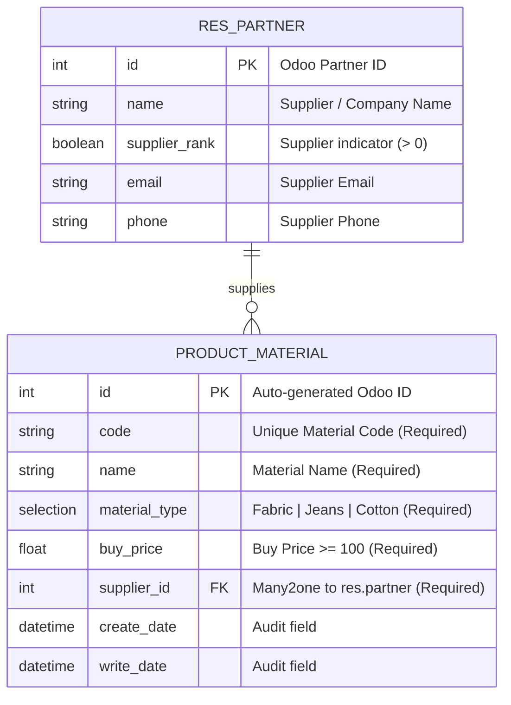
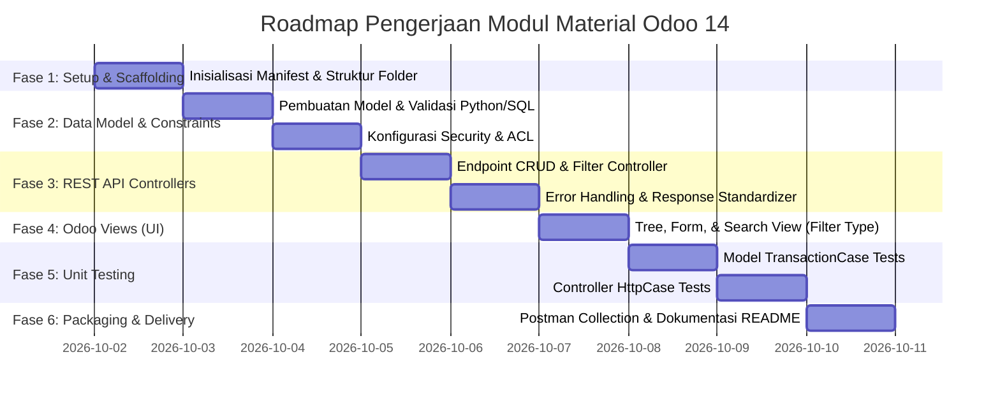

# Product Requirement Document (PRD) & Implementation Plan
## Odoo 14 Custom Module: Material Registration & REST API

---

## 1. Document Control & Executive Summary

| Attribute | Details |
| :--- | :--- |
| **Project Name** | Material Management Module (Odoo 14) |
| **Document Version** | 1.0.0 |
| **Target Framework** | Odoo 14.0 (Community / Enterprise) |
| **Python Version** | Python 3.8+ |
| **Database** | PostgreSQL 12+ |
| **Author** | Backend Engineer Candidate |
| **Reviewer** | Recruitment Team of KeDA Tech |
| **Status** | Approved for Implementation |

### 1.1 Executive Summary
Modul ini bertujuan untuk memenuhi kebutuhan registrasi dan pengelolaan material yang akan dijual. Modul dibangun di atas platform Odoo 14 dengan kapabilitas utama mencakup: validasi data bisnis terpusat, arsitektur relasional dengan supplier (`res.partner`), penyediaan REST API berbasis controller untuk operasi CRUD dan filtering, serta suite pengujian otomatis (Unit Testing & Integration Testing).

---

## 2. Business Requirements & User Stories

### 2.1 Business Objectives
- Menyediakan sistem inventarisasi master data material yang terstandarisasi.
- Menjamin integritas data registrasi produk/material (seluruh field wajib diisi dan harga beli valid).
- Mengintegrasikan relasi material dengan supplier resmi perusahaan.
- Menyediakan antarmuka integrasi sistem eksternal melalui REST API Controller.

### 2.2 User Stories
1. **US-01 (Create Material)**: Sebagai pengguna/klien, saya ingin dapat mendaftarkan material baru dengan informasi kode, nama, tipe, harga beli, dan supplier terkait sehingga material siap untuk diperjualbelikan.
2. **US-02 (Input Validation)**: Sebagai sistem, saya harus menolak pendaftaran atau pembaruan material apabila ada field wajib yang kosong atau harga beli (`Material Buy Price`) kurang dari 100.
3. **US-03 (View & Filter Materials)**: Sebagai pengguna/klien, saya ingin melihat daftar seluruh material yang tersimpan dan dapat memfilter daftar tersebut berdasarkan tipe material (`Fabric`, `Jeans`, `Cotton`).
4. **US-04 (Update Material)**: Sebagai pengguna/klien, saya ingin memperbarui informasi material yang telah ada.
5. **US-05 (Delete Material)**: Sebagai pengguna/klien, saya ingin menghapus material yang sudah tidak relevan.
6. **US-06 (REST API Access)**: Sebagai developer frontend atau sistem pihak ketiga, saya ingin mengakses operasi CRUD material melalui endpoint REST API berbasis JSON.

---

## 3. Data Model & Entity Relationship Diagram (ERD)

### 3.1 Entity Relationship Diagram (ERD)



### 3.2 Data Dictionary (`product.material` / `material.registration`)

Nama Model yang direkomendasikan: `material.material` atau `product.material`. Kita gunakan `material.material` agar independen dan bersih.

| Field Name | Odoo Technical Field | Data Type | Constraint / Rules | Deskripsi |
| :--- | :--- | :--- | :--- | :--- |
| `id` | `id` | Integer | Primary Key (Auto) | Identifier record Odoo |
| **Material Code** | `code` | `fields.Char` | `required=True`, unique (SQL Constraint) | Kode identifikasi unik material |
| **Material Name** | `name` | `fields.Char` | `required=True` | Nama material |
| **Material Type** | `material_type` | `fields.Selection` | `required=True`, Options: `fabric`, `jeans`, `cotton` | Tipe material kain |
| **Material Buy Price** | `buy_price` | `fields.Float` | `required=True`, Validation: `>= 100` | Harga beli material |
| **Related Supplier** | `supplier_id` | `fields.Many2one` | `required=True`, Comodel: `'res.partner'`, `ondelete='restrict'` | Rekanan supplier |

### 3.3 Validasi & Business Rules
1. **Mandatory Fields**: Field `code`, `name`, `material_type`, `buy_price`, dan `supplier_id` bernilai `required=True` di level Python model dan database.
2. **Buy Price Rule**: 
   - Nilai `buy_price` tidak boleh `< 100`.
   - Diimplementasikan menggunakan Python Constraint (`@api.constrains('buy_price')`) dan SQL Constraint (`CHECK(buy_price >= 100)`).
3. **Unique Code Rule**:
   - Kode material harus unik untuk mencegah duplikasi data (`_sql_constraints = [('code_uniq', 'unique(code)', 'Kode Material harus unik!')]`).
4. **Supplier Filtering**:
   - Pilihan supplier pada UI Odoo dibatasi domain `[('supplier_rank', '>', 0)]` atau partner bertipe supplier/vendor.

---

## 4. REST API Controller Specifications

Semua endpoint dibangun menggunakan Odoo Controller (`odoo.http.Controller`) dengan rute berawalan `/api/v1/materials`. Format payload dan respon menggunakan JSON.

### 4.1 Ringkasan Endpoint

| Method | Endpoint | Deskripsi | Status Sukses |
| :--- | :--- | :--- | :--- |
| `POST` | `/api/v1/materials` | Registrasi material baru | `201 Created` |
| `GET` | `/api/v1/materials` | Mengambil seluruh material (mendukung query filter `material_type`) | `200 OK` |
| `GET` | `/api/v1/materials/<int:material_id>` | Detail spesifik satu material | `200 OK` |
| `PUT` | `/api/v1/materials/<int:material_id>` | Memperbarui seluruh/sebagian data material | `200 OK` |
| `DELETE` | `/api/v1/materials/<int:material_id>` | Menghapus satu material | `200 OK` |

### 4.2 Detail Payload & Respon

#### A. Create Material (`POST /api/v1/materials`)
- **Headers**: `Content-Type: application/json`
- **Request Body**:
  ```json
  {
    "code": "MAT-001",
    "name": "Denim Raw 14oz",
    "material_type": "jeans",
    "buy_price": 150000.0,
    "supplier_id": 14
  }
  ```
- **Response Success (`201 Created`)**:
  ```json
  {
    "status": "success",
    "message": "Material successfully created",
    "data": {
      "id": 1,
      "code": "MAT-001",
      "name": "Denim Raw 14oz",
      "material_type": "jeans",
      "buy_price": 150000.0,
      "supplier": {
        "id": 14,
        "name": "PT Tekstil Prima"
      }
    }
  }
  ```
- **Response Error (`400 Bad Request`)** *(Contoh harga < 100)*:
  ```json
  {
    "status": "error",
    "message": "Material buy price must be at least 100",
    "errors": {
      "buy_price": "Value 85.0 is below minimum threshold 100"
    }
  }
  ```

#### B. List & Filter Materials (`GET /api/v1/materials`)
- **Query Params**:
  - `material_type` *(optional)*: `fabric` | `jeans` | `cotton`
- **Contoh Request**: `GET /api/v1/materials?material_type=jeans`
- **Response Success (`200 OK`)**:
  ```json
  {
    "status": "success",
    "count": 1,
    "data": [
      {
        "id": 1,
        "code": "MAT-001",
        "name": "Denim Raw 14oz",
        "material_type": "jeans",
        "buy_price": 150000.0,
        "supplier": {
          "id": 14,
          "name": "PT Tekstil Prima"
        }
      }
    ]
  }
  ```

#### C. Update Material (`PUT /api/v1/materials/<int:material_id>`)
- **Request Body**:
  ```json
  {
    "name": "Denim Raw 15oz Heavyweight",
    "buy_price": 175000.0
  }
  ```
- **Response Success (`200 OK`)**:
  ```json
  {
    "status": "success",
    "message": "Material successfully updated",
    "data": {
      "id": 1,
      "code": "MAT-001",
      "name": "Denim Raw 15oz Heavyweight",
      "material_type": "jeans",
      "buy_price": 175000.0,
      "supplier": {
        "id": 14,
        "name": "PT Tekstil Prima"
      }
    }
  }
  ```

#### D. Delete Material (`DELETE /api/v1/materials/<int:material_id>`)
- **Response Success (`200 OK`)**:
  ```json
  {
    "status": "success",
    "message": "Material MAT-001 has been deleted"
  }
  ```
- **Response Error (`404 Not Found`)**:
  ```json
  {
    "status": "error",
    "message": "Material with ID 999 not found"
  }
  ```

---

## 5. Security & Access Rights

1. **Security Group**:
   - `group_material_user`: Hak akses Read & View.
   - `group_material_manager`: Hak akses Full CRUD (Create, Read, Write, Unlink).
2. **Access Control List (`ir.model.access.csv`)**:
   - Konfigurasi izin untuk model `material.material` bagi user internal dan base user.
3. **Controller Security**:
   - `auth="public"` atau `auth="user"` (untuk API test case biasanya dikonfigurasi `auth="none"` atau `auth="public"` dengan `csrf=False` agar mudah diuji melalui Postman / automated test tool).

---

## 6. Testing Strategy & Test Scenarios

Sesuai instruksi soal, pengujian otomatis menggunakan framework test Odoo (`odoo.tests.common`).

### 6.1 Unit Test Scope
| File Target | Tipe Test | Fokus Pengujian |
| :--- | :--- | :--- |
| `tests/test_material_model.py` | `TransactionCase` | 1. Sukses create material dengan atribut valid.<br>2. Verifikasi constraint error jika `buy_price < 100`.<br>3. Verifikasi duplikasi `code` memicu constraint.<br>4. Verifikasi field required yang tidak diisi. |
| `tests/test_material_controller.py` | `HttpCase` | 1. Endpoint POST registrasi material sukses (201).<br>2. Endpoint POST gagal jika `buy_price < 100` (400).<br>3. Endpoint GET all material (200).<br>4. Endpoint GET filter by `material_type` (200).<br>5. Endpoint PUT update material (200).<br>6. Endpoint DELETE material (200).<br>7. Endpoint GET/PUT/DELETE record 404. |

---

## 7. Module Directory Structure

```text
material_management/
├── __init__.py
├── __manifest__.py
├── models/
│   ├── __init__.py
│   └── material.py
├── controllers/
│   ├── __init__.py
│   └── main.py
├── views/
│   ├── material_views.xml
│   └── menu_views.xml
├── security/
│   ├── material_security.xml
│   └── ir.model.access.csv
└── tests/
    ├── __init__.py
    ├── test_material_model.py
    └── test_material_controller.py
```

---

## 8. Multi-Phase Implementation Plan



### Fase 1: Environment Setup & Modul Scaffolding
- **Deskripsi**: Menyiapkan struktur folder modul Odoo 14 (`material_management` atau `material_registration`).
- **Aktivitas**:
  - Membuat root directory modul dan subfolder: `models/`, `controllers/`, `views/`, `security/`, `tests/`.
  - Membuat file manifest `__manifest__.py` dengan dependencies (`base`, `web`).
  - Menginisialisasi `__init__.py` pada seluruh folder package.
- **Output / Deliverables**: Modul dapat terdeteksi oleh Odoo Apps List.

### Fase 2: Model Definition, Constraints, & Security
- **Deskripsi**: Mengimplementasikan model `material.material` beserta validasi bisnis ketat dan hak akses.
- **Aktivitas**:
  - Definisikan fields: `code`, `name`, `material_type` (Selection: Fabric, Jeans, Cotton), `buy_price`, `supplier_id` (`res.partner`).
  - Terapkan constraint Python `@api.constrains('buy_price')` untuk memastikan nilai `>= 100`.
  - Terapkan SQL constraints untuk keunikan `code` dan validasi database `CHECK(buy_price >= 100)`.
  - Buat group akses dan definisikan izin di `security/ir.model.access.csv`.
- **Output / Deliverables**: Model ter-generate di PostgreSQL dengan constraint aktif dan hak akses terkonfigurasi.

### Fase 3: REST API Controllers Development
- **Deskripsi**: Membangun Odoo HTTP Controller untuk melayani komunikasi REST API format JSON.
- **Aktivitas**:
  - Buat class controller di `controllers/main.py` mewarisi `http.Controller`.
  - Implementasikan endpoint:
    - `POST /api/v1/materials`: Validasi payload, handling `create()`, return format standar.
    - `GET /api/v1/materials`: Mengambil data material dengan dukungan parameter `?material_type=...`.
    - `GET /api/v1/materials/<id>`: Mengambil satu material spesifik.
    - `PUT /api/v1/materials/<id>`: Validasi dan update record `write()`.
    - `DELETE /api/v1/materials/<id>`: Hapus record `unlink()`.
  - Implementasikan wrapper error handler (menangani 400 Bad Request jika input invalid, 404 jika ID tidak ditemukan, dan 500 jika terjadi internal error).
- **Output / Deliverables**: REST API lengkap yang siap diakses via HTTP client.

### Fase 4: Odoo Backend UI (Views & Actions)
- **Deskripsi**: Menyediakan antarmuka grafis di backend Odoo (nilai plus yang melengkapi requirement client).
- **Aktivitas**:
  - Buat `views/material_views.xml`:
    - **Tree View (List)**: Menampilkan kolom Code, Name, Type, Buy Price, Supplier.
    - **Form View**: Form input registrasi material dengan layout rapi.
    - **Search View**: Search by name/code dan Filter button berdasarkan Material Type (Fabric, Jeans, Cotton) serta Group by Type.
  - Buat action window dan menu item di `views/menu_views.xml`.
- **Output / Deliverables**: Pengguna dapat melihat, memfilter, mengedit, dan menghapus material langsung dari antarmuka Web Odoo.

### Fase 5: Comprehensive Automated Unit Testing
- **Deskripsi**: Membangun suite testing otomatis menggunakan modul `odoo.tests`.
- **Aktivitas**:
  - **Model Testing (`tests/test_material_model.py`)**:
    - Test case pembuatan material sukses.
    - Test case kegagalan saat `buy_price` bernilai di bawah 100 (memastikan raise `ValidationError`).
    - Test case validasi keunikan `code`.
  - **Controller Testing (`tests/test_material_controller.py`)**:
    - Test simulasi request HTTP ke API: Create, Read (dengan filter & tanpa filter), Update, dan Delete.
    - Test respon kode status (200, 201, 400, 404).
- **Output / Deliverables**: Seluruh unit test lolos saat dijalankan dengan parameter `--test-enable`.

### Fase 6: Dokumentasi, Postman Collection, & Persiapan Submission
- **Deskripsi**: Finalisasi paket pengerjaan untuk pengiriman hasil tes rekrutmen ke KeDA Tech.
- **Aktivitas**:
  - Dokumentasi file `README.md` (cara install modul, cara menjalankan unit test, contoh curl / Postman request).
  - Ekspor Postman Collection JSON untuk pengujian API.
  - Lampiran diagram ERD (format PNG atau Mermaid terintegrasi).
  - Review kesesuaian seluruh kriteria terhadap dokumen soal `Backend Odoo Test.pdf`.
- **Output / Deliverables**: ZIP archive / Git repository siap dikirim ke `recruitment@keda-tech.com`.

---

## 9. Definition of Done (DoD) Checklist

- [x] Modul Odoo 14 berhasil diinisialisasi dan lolos kompilasi sintaks.
- [x] Field Material Code, Name, Type, Buy Price, dan Related Supplier beroperasi sesuai spesifikasi.
- [x] Validasi `buy_price < 100` berhasil memblokir input baik di Python constraint, SQL constraint, maupun REST API.
- [x] Pilihan Material Type mencakup Fabric, Jeans, Cotton.
- [x] Endpoint REST API untuk Create, List (dengan filter), Detail, Update, dan Delete berfungsi dengan format response JSON terstruktur.
- [x] Unit test mencakup pengujian Model (TransactionCase) dan Controller (HttpCase).
- [x] Dokumen ERD dan panduan instalasi/pengujian terdokumentasi lengkap (README.md, Postman collection, Docker Compose).
